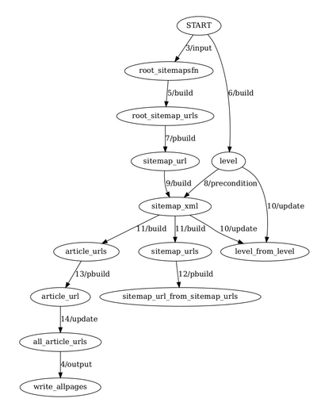

# CsvLang: Late Binding Rendering (WIP)

## Introduction

* MVC paradigm taken to the max, with assists from relational (SQL) and
  map-reduce programming.

* Question: Can the view and controller be automatically generated? Or at least
  provide reasonable defaults out of the box?

* Why an approach like this might be useful:
  *  automatic fine-grain composition of UIs
  *  enables automatic brevity/personalization of interfaces
  *  with things like VR, the number of possibilities
     for view and control is going to increase.

* CSVLang is an exploration of the tradeoffs involved in designing a system
  that prioritizes goals like the above, especially when we don't rule out
  the use of "strange" programming models.

* Caveat: the "loss of control", the very strict separation of layers, and
  opinionated type system will probably feel strange at first. The hope is that
  the benefits far outweigh the costs.

## Core ideas

* "Everything is an SQL table": The fundamental data structure is something
  very similar to an in-memory SQL table. Some n fields together are the key,
  and everything else is the data.

* Higher-level type system: In addition to low-level types like 'integer',
  the system has higher-level types like "duration", "timepoint", "date".

* Emphasize encoding "Information *architecture*" vs. separately thinking
  about view and controller.

* Introduces the notion of an "information architecture model" aka IAModel,
  which is *strictly* the table corresponding to the model, along with some
  additional columns that the IAModel can populate. This definition is key: it
  allows multiple IAModels to be computed and live side-by-side for the same
  model.

* The hope is that we figure out how to encode the "information architecture",
  polished views and controllers can be generated by default. Benefit: code
  reuse, harmony in views and controllers for different models.

## Example: Printing a quarterly calendar

A printed calendar is somewhat weird. The underlying data is technically
just a simple ordered set of (date, day-of-week) pairs i.e.,
it's a *one-dimensional time series*. But the canonical way humans display
that time series is in *two dimensions*.

Here's how I mapped the problem to the approach described above.

* Model: rows mapping from a column named 'date' to a column named 'dow' that
  contains the day of the week.

* IAModel: **Goes from 1D to 2D: adds a column monthweek to reflect the week
  number within the month, and explicitly add the day-of-month as the field
  mm**. Also encodes that the day-of-week column is usable as the X coordinate,
  and the monthweek column is usable as the Y coordinate, with the day-of-month
  being the value *at* that coordinate. Note that this is still abstract: we
  "reshaped" the data, but we didn't say anything about rows and cells as in
  a table.

  That will be a hint to the rest of the system that *this* IAModel can/should
  be matched up with some View to render the Model on a 2D output like paper,
  console, screen.

  But isn't fully specified yet so it's unclear this is actually a view.

  The column monthweek reflects the (arbitrary) human-designed way to group the
  days within a month by weeks. And weeks in turn depend on the days of the
  week. Oddly, days of the week run continously without consideration for leap
  years or the differences in the number of days in months (but they *do*
  respect leap seconds).

* View: this is the part this is customized to the output device. In the example,
  a GridView capable of laying out any IAModel is used.

  For console output, this amounts to constructing a matrix in memory and
  printing it, with some standard stuff like automatically resizing column
  widths etc. Kinda like rendering a HTML table. The X and Y coordinate hints
  in the IAModel are used here. Things like fonts, color for console output are
  all done here.  **Graphical output, PDF output etc *must* be different Views
  than console output.**

  The hope is that a single View capable of displaying a table can be
  automatically used for a wide range of IAModels, with the rich type system
  guiding both matching and rendering policies.

* Controller: (wip) The basic idea would be that the IAModel-to-View matching
  process will record enough information so that *for the types built into
  the system (e.g., date, duration)* controllers *and commands to update
  the model* can be autogenerated.

  For instance, in GUIs clicking on a number in a View ultimately derived
  from a column in the Model of type 'duration', may open a standard
  duration-picker widget. Which will result in an SQL update being performed,
  triggering a rendering update.

To force myself to think about the problem in a principled way, I started
thinking about this as if it were an SQL query to generate a calendar.

I like to pin a single-page quarterly calendar in my study to mark off
important dates. I used to do it by piping the output of the cat command to a
file, then quickly editing the file to make the text bigger, and finally
printing it.

Later, to avoid the formatting step, I wrote a somewhat involved Google Sheets
program to print the quarterly calendar (embedding the formatting in the
cells).

But as is a programmer's wont, I started thinking about generalizing that and
printing something different in the boxes than the day of the month.

## Printing a calendar: wtf

I'm intermediate at SQL, so it's possible I missed something, but

On deeper examination, we can imagine a calendar 

# Sales Pitch

- Jeepial (which tentatively stands for Glue/Graph Programming Language) is an
  experimental DSL/programming language
  that is designed to enable power end-users to leverage single-machine
  parallelism for ad hoc processing of medium-size datasets (e.g., sub-TB, not
  PB). Think AutoHotKey and spreadsheets, not programming languages and RDBMS.

- Jeepial strives to be easier for a power user to work with than Unix
  tools like xargs and find, when a one-liner isn't enough.

- Jeepial prioritizes "ergonomic" factors over efficiency when they conflict: factors
  such as understandability of the programming model, "guessable" semantics,
  "getting it right with fewer iterations".

- The sweet spot would be things like an ad hoc script that analyzes a list of
  RSS feeds based on keywords and emails a subset of the articles to the user,
  or ad hoc image processing tasks (see example at the end).

Why this is useful:

- Desktop cores are likely underused: People's time is being wasted because
  it's simply too much work to reliably create ad hoc parallel workflows, even
  single-machine ones.

- Fun: It's an interesting learning exercise for me.

# Syntax

The syntax is heavily inspired by the Ninja software build tool, which itself is
inspired by 'make'. Each Jeepial line has this syntax:

    <operation> <outputs>: <code-fragment>

E.g.,

    build article_urls, new_sitemap_urls: process_one_sitemap(url)

This says that two outputs named `article_urls` and `new_sitemap_urls` will
be created when the function `process_one_sitemap()` is called with the value of
a previously-generated output `url` as its parameter.

# Example

Here is a program that crawls some websites' sitemaps [a sitemap file
can specify other sitemap URLs to also be crawled].

    input root_sitemapsfn: argv(1)

    build root_sitemap_urls: lines_in_file root_sitemapsfn
    build level: 0  # to crawl only three levels deep.

    # 'pbuild' is how you indicate that parallelism may be possible.
    pbuild sitemap_url: unpack(root_sitemap_urls)

    # don't crawl more than two-deep.
    precondition sitemap_xml: if level < 3
    build sitemap_xml: wget(sitemap_url)
    update level: level + 1

    build article_urls, sitemap_urls: process_one_sitemap(sitemap_xml)

    pbuild sitemap_url: unpack(sitemap_urls)

    pbuild article_url: unpack(article_urls)
    update all_article_urls: append(article_url)

    output write_allpages: write_as_lines_to_file(argv(2), all_article_urls)

resulting in the graph:

# Programming Model

TLDR: Very similar to unrolling a sequential machine in hardware design by
"unrolling" the circuit and adding flip-flops/latches between unrolled
instances.

Jeepial is optimized for scatter-gather type parallelism (commonly occurs in
`subdivide -> recursive solve -> assemble` type tasks).

- Each unique output becomes a **node in a graph**, with output's name being
  the label of the nodel. An output's **value** is different from its name.

- The lines in the program specify the connections between nodes (i.e., the
  edges of the graph).

- The *label on each edge* is the code fragment which when executed produces
  the outputs at the other end of the edge.

- Topological sorting provides the order of execution.

- In the case of cycles in the graph, snip the cycle at the inedge into the
  "topmost" node, and create a *renamed copy* of that node. e.g., `sitemap_url_from_sitemap_urls`.
  TODO: clarify this, including multiple loops.

- If a code fragment produces a list of values for some output, propagate each
  value independently through the graph in parallel. e.g., the outedge from
  `root_sitemap_urls` to `sitemap_url`.

- (Next epoch. TODO: expand on epochs) Copy renamed nodes' value, if any, into
  the target node and propagate. All successor epochs of a given epoch run in
  parallel.

- The built-in `append()` provides the only way to transport a node's value to
  the external world at the at the end of the program. See `all_article_urls`
  in the example above.

- Execute the outedges from "gather" nodes (e.g., `output`) after all
  epochs are processed.

- **Communication between sub-tasks is not possible**: each subtask is
  independent and has no knowledge of its siblings or parents.

## Possibly Interesting Aspects of the Programming Model

- Defined and useful behavior for cycles in make-like graphs

- Defined and useful specification for where cycles in graphs are "snipped"

- Ergonomic "scatter" notation (`pbuild` and `unpack`)

- Reasoning about the program is a first-class requirement of the system (e.g.,
  an image of the underlying graph of the program is a first-class output).

# Implementation

The current implementation uses Lua code fragments, which are directly
"eval'd".

(see run.lua in the repo) Quite literally, a Lua function named `lines_in_file` gets called. And quite
literally the return value of that function is put inside a symbol table (hash)
under the key `root_sitemap_urls`. And again, quite literally the function
`lines_in_file` is called with its first argument set to the *value* for
`root_sitemaps_fn` from the symbol table [which should have been previously
set].

Parallelism happens when the operations like "pbuild" and "unpack" happen. This
is implemented by serially iterating through a list [will likely be replaced with
real parallelism soon].

## Why Jeepial looks to build tools

Build tools have a long history of using single-machine parallelism to speed
things up.

And build tools are heavily used, so the syntax and concepts from those
languages are well-known.

And for the next set of power-user things (checkpointing, caching etc), I have
a hunch build tools' learnings from reproducible builds is going to be useful.

## Example of an ad hoc image processing task

My ad hoc image processing scripts usually get the job done by chaining
multiple invocations of ImageMagick command-line tools. Frequently my scripts
create temporary files for debugging (it would be great if they were
automatically "garbage collected"). And as I make progress and iterate, I
frequently have to start from the *middle* of the flow, or run the flow with a
different image input to check my heuristics. In such cases, something like
Make's ability to do incremental builds, and pattern substitution seem like
good fit but Make "feels" too specific to building *software*, resulting in conventions
and syntax that is much more tuned for programmers than non-programmer power
users.

**Concrete example of an ad hoc image processing task that I did recently:**
reducing color ink usage on my inkjet printer when printing web articles. Web
articles are intended for screens so they have large photos that remain even in
the "reader view" of browsers.

My approach was to convert each printed page to bitmaps (pdftoppm), then modify
the bitmaps' regions that correspond to photos such that less ink would be
used, and then concatenate the modified bitmaps into a (much larger) PDF.

Note: images are rasterized at high dpi in the pdftoppm step to ensure that the
final printed output is high quality.

Each page's bitmap is processed as follows: divide into approx 64x64 pixel
tiles, for each tile convert RGB to CMYK color space and output the average
CMYK values per tile. **This average CMYK value is quite literally a proxy for
the amount of ink the inkjet printer will lay down, based on my review of how
inkjet printers work**. I use a heuristic that the top 20% of "ink intensities"
are "excessive" and those regions should be munged to use less ink.

Which can be accomplished by either by simply replacing the tile with all-white
(removing the tile == zero ink) or overlaying small white rectangles in those
regions (and relying on the human eye to "fill in" the gaps), or similar.

eof
