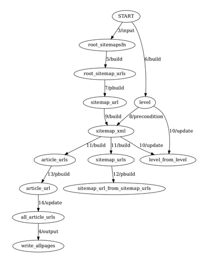

# Jeepial: Glue Programming Language

# Sales Pitch

- Jeepial (which tentatively stands for Glue/Graph Programming Language) is an
  experimental DSL/programming language
  that is designed to enable power end-users to leverage single-machine
  parallelism for ad hoc processing of medium-size datasets (e.g., sub-TB, not
  PB). Think AutoHotKey and spreadsheets, not programming languages and RDBMS.

- Jeepial strives to be easier for a power user to work with than Unix
  tools like xargs and find, when a one-liner isn't enough.

- Jeepial prioritizes "ergonomic" factors over efficiency when they conflict: factors
  such as understandability of the programming model, "guessable" semantics,
  "getting it right with fewer iterations".

- The sweet spot would be things like an ad hoc script that analyzes a list of
  RSS feeds based on keywords and emails a subset of the articles to the user,
  or ad hoc image processing tasks (see example at the end).

Why this is useful:

- Desktop cores are likely underused: People's time is being wasted because
  it's simply too much work to reliably create ad hoc parallel workflows, even
  single-machine ones.

- Fun: It's an interesting learning exercise for me.

# Syntax

The syntax is heavily inspired by the Ninja software build tool, which itself is
inspired by 'make'. Each Jeepial line has this syntax:

    <operation> <outputs>: <code-fragment>

E.g.,

    build article_urls, new_sitemap_urls: process_one_sitemap(url)

This says that two outputs named `article_urls` and `new_sitemap_urls` will
be created when the function `process_one_sitemap()` is called with the value of
a previously-generated output `url` as its parameter.

# Example

Here is a program that crawls some websites' sitemaps [a sitemap file
can specify other sitemap URLs to also be crawled].

    input root_sitemapsfn: argv(1)

    build root_sitemap_urls: lines_in_file root_sitemapsfn
    build level: 0  # to crawl only three levels deep.

    # 'pbuild' is how you indicate that parallelism may be possible.
    pbuild sitemap_url: unpack(root_sitemap_urls)

    # don't crawl more than two-deep.
    precondition sitemap_xml: if level < 3
    build sitemap_xml: wget(sitemap_url)
    update level: level + 1

    build article_urls, sitemap_urls: process_one_sitemap(sitemap_xml)

    pbuild sitemap_url: unpack(sitemap_urls)

    pbuild article_url: unpack(article_urls)
    update all_article_urls: append(article_url)

    output write_allpages: write_as_lines_to_file(argv(2), all_article_urls)

resulting in the graph:

# Programming Model

TLDR: Very similar to unrolling a sequential machine in hardware design by
"unrolling" the circuit and adding flip-flops/latches between unrolled
instances.

Jeepial is optimized for scatter-gather type parallelism (commonly occurs in
`subdivide -> recursive solve -> assemble` type tasks).

- Each unique output becomes a **node in a graph**, with output's name being
  the label of the nodel. An output's **value** is different from its name.

- The lines in the program specify the connections between nodes (i.e., the
  edges of the graph).

- The *label on each edge* is the code fragment which when executed produces
  the outputs at the other end of the edge.

- Topological sorting provides the order of execution.

- In the case of cycles in the graph, snip the cycle at the inedge into the
  "topmost" node, and create a *renamed copy* of that node. e.g., `sitemap_url_from_sitemap_urls`.
  TODO: clarify this, including multiple loops.

- If a code fragment produces a list of values for some output, propagate each
  value independently through the graph in parallel. e.g., the outedge from
  `root_sitemap_urls` to `sitemap_url`.

- (Next epoch. TODO: expand on epochs) Copy renamed nodes' value, if any, into
  the target node and propagate. All successor epochs of a given epoch run in
  parallel.

- The built-in `append()` provides the only way to transport a node's value to
  the external world at the at the end of the program. See `all_article_urls`
  in the example above.

- Execute the outedges from "gather" nodes (e.g., `output`) after all
  epochs are processed.

- **Communication between sub-tasks is not possible**: each subtask is
  independent and has no knowledge of its siblings or parents.

## Possibly Interesting Aspects of the Programming Model

- Defined and useful behavior for cycles in make-like graphs

- Defined and useful specification for where cycles in graphs are "snipped"

- Ergonomic "scatter" notation (`pbuild` and `unpack`)

- Reasoning about the program is a first-class requirement of the system (e.g.,
  an image of the underlying graph of the program is a first-class output).

# Implementation

The current implementation uses Lua code fragments, which are directly
"eval'd".

(see run.lua in the repo) Quite literally, a Lua function named `lines_in_file` gets called. And quite
literally the return value of that function is put inside a symbol table (hash)
under the key `root_sitemap_urls`. And again, quite literally the function
`lines_in_file` is called with its first argument set to the *value* for
`root_sitemaps_fn` from the symbol table [which should have been previously
set].

Parallelism happens when the operations like "pbuild" and "unpack" happen. This
is implemented by serially iterating through a list [will likely be replaced with
real parallelism soon].

## Why Jeepial looks to build tools

Build tools have a long history of using single-machine parallelism to speed
things up.

And build tools are heavily used, so the syntax and concepts from those
languages are well-known.

And for the next set of power-user things (checkpointing, caching etc), I have
a hunch build tools' learnings from reproducible builds is going to be useful.

## Example of an ad hoc image processing task

My ad hoc image processing scripts usually get the job done by chaining
multiple invocations of ImageMagick command-line tools. Frequently my scripts
create temporary files for debugging (it would be great if they were
automatically "garbage collected"). And as I make progress and iterate, I
frequently have to start from the *middle* of the flow, or run the flow with a
different image input to check my heuristics. In such cases, something like
Make's ability to do incremental builds, and pattern substitution seem like
good fit but Make "feels" too specific to building *software*, resulting in conventions
and syntax that is much more tuned for programmers than non-programmer power
users.

**Concrete example of an ad hoc image processing task that I did recently:**
reducing color ink usage on my inkjet printer when printing web articles. Web
articles are intended for screens so they have large photos that remain even in
the "reader view" of browsers.

My approach was to convert each printed page to bitmaps (pdftoppm), then modify
the bitmaps' regions that correspond to photos such that less ink would be
used, and then concatenate the modified bitmaps into a (much larger) PDF.

Note: images are rasterized at high dpi in the pdftoppm step to ensure that the
final printed output is high quality.

Each page's bitmap is processed as follows: divide into approx 64x64 pixel
tiles, for each tile convert RGB to CMYK color space and output the average
CMYK values per tile. **This average CMYK value is quite literally a proxy for
the amount of ink the inkjet printer will lay down, based on my review of how
inkjet printers work**. I use a heuristic that the top 20% of "ink intensities"
are "excessive" and those regions should be munged to use less ink.

Which can be accomplished by either by simply replacing the tile with all-white
(removing the tile == zero ink) or overlaying small white rectangles in those
regions (and relying on the human eye to "fill in" the gaps), or similar.

eof
